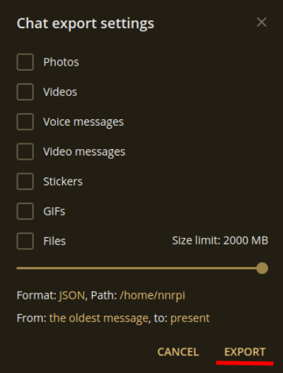

# Telegram statistics
Here you can find a program that somehow analyzes your
Telegram conversations. Right now **it
can**:
* count messages
* count total message length
* count average message length
* determine who replied the user the most and to whom did the user
replied the most
* determine and count the most often used words

## Usage
1. **Export** the Telegram chat you want to analyze:
    * Open chat
    * Click on 3 dots in the top right corner 
    * Click on "Export chat history" 
    * Make everything like in the picture below and click on the "Export"
    button 
    * After this your chat exporting will start. Wait till it ends
    * You will see a directory called like 'ChatExport_<today_date>'.
    There could be several files, the one you need is called "result.json"
2. **Run** the program:
    * Open Terminal, go to the repository directory and run
    command `./main.py ~/path/to/the/result.json`.
    You should see the output like:
    
    